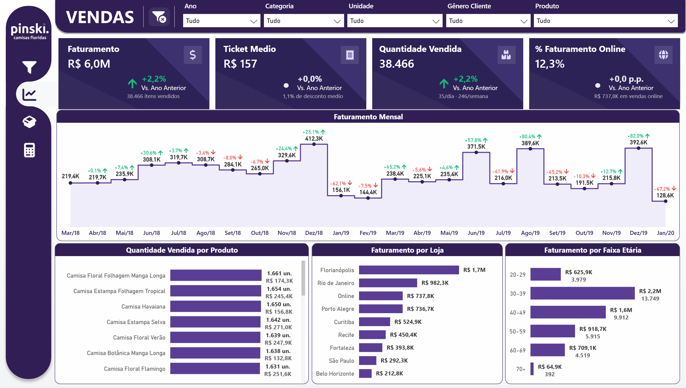
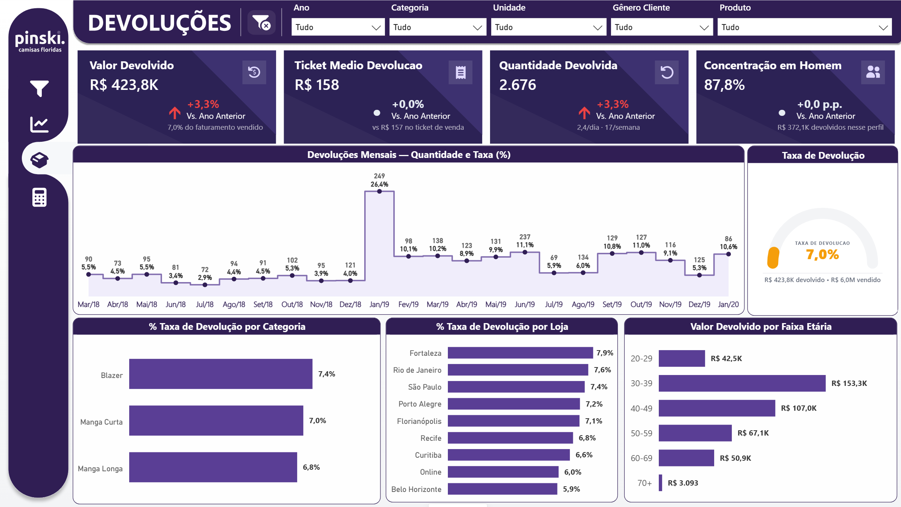
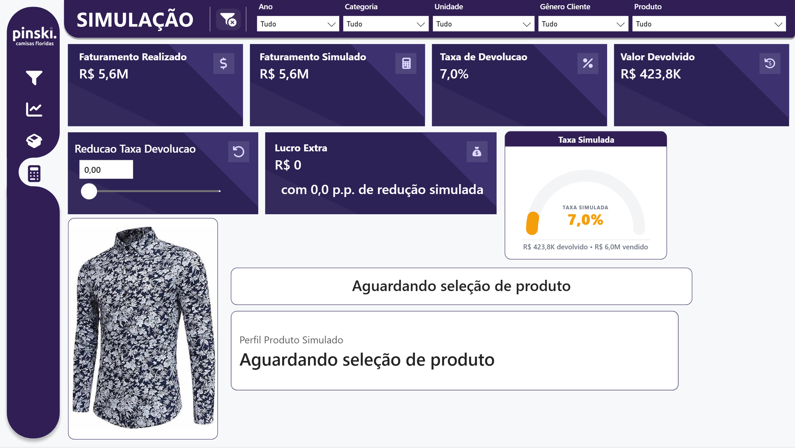

<div align="center">

# 👔 PINSKI Camisas Floridas — Diagnóstico de Vendas e Devoluções

**Power BI · DAX · Power Query**

[](https://linkedin.com/in/victor-ozores/)
[](https://app.xperiun.com/in/victor-ozores)
[](https://github.com/victor-ozores)

</div>

---

## 📌 Resumo

Projeto desenvolvido para o **Desafio Kickstart** da comunidade Power BI Experience — um case fictício de consultoria de Business Intelligence contratada pela PINSKI Camisas Floridas, marca de moda masculina com lojas físicas e e-commerce.

O cenário: a empresa notou uma queda de faturamento a partir de meados de 2019 e precisava entender a causa, acompanhar vendas e devoluções diariamente, e simular o impacto de reduzir a taxa de devolução por produto. A base de dados (extraída do sistema XPER, em Excel) cobre Março/2018 a Janeiro/2020.

O dashboard entrega 3 páginas — Vendas, Devoluções e Simulação — com 134 medidas DAX, 7 funções DAX definidas pelo usuário (UDFs) para geração de cards, gauges e donuts em SVG, e um simulador interativo de redução de taxa de devolução com drill-through.

## 🔗 Ver Dashboard Online

[](https://app.powerbi.com/view?r=eyJrIjoiOGNjNjFmZDItOThiNi00OWFiLTg4Y2YtYzAwNzEwM2FiYzY4IiwidCI6IjY1OWNlMmI4LTA3MTQtNDE5OC04YzM4LWRjOWI2MGFhYmI1NyJ9&pageName=b2ef2f6eecd6003e150c)

## 📢 Apresentação do Projeto

[](https://gamma.app/docs/PINSKI-Camisas-Floridas-Diagnostico-de-Vendas-e-Devolucoes-wncniz2k36l6trs)

---

## 💡 O Que Ele Responde

- Qual o faturamento e o total em devolução da PINSKI, e como eles variam mês a mês?
- Quais os produtos e lojas com maior e menor desempenho, por quantidade e por faturamento?
- Qual categoria de produto concentra a maior taxa de devolução?
- Qual perfil de cliente (gênero, faixa etária) mais compra e mais devolve?
- Qual seria o lucro extra ao reduzir a taxa de devolução de um produto específico, de forma simulada e interativa?

---

## 📊 Páginas do Dashboard

| Página         | O que entrega                                                                                                                                                              |
| -------------- | -------------------------------------------------------------------------------------------------------------------------------------------------------------------------- |
| **Vendas**     | KPIs de faturamento, ticket médio, quantidade vendida e % de faturamento online; evolução mensal com variação MoM; ranking de produtos, lojas e faixa etária               |
| **Devoluções** | KPIs de valor e quantidade devolvida, ticket médio de devolução e concentração por perfil de cliente; taxa de devolução mensal e por categoria, com drill-down até produto |
| **Simulação**  | Simulador interativo: reduz a taxa de devolução de um produto filtrado via slicer e calcula o Lucro Extra resultante, com gauge comparando taxa atual vs. simulada         |

---

## 📸 Preview

### Vendas



### Devoluções



### Simulação



---

<details>
<summary>⚙️ Detalhes Técnicos</summary>

<br>

### Arquitetura

```
Excel (extração do sistema XPER)
  └── Power Query
        ├── Fact_Vendas       ← vendas e devoluções, nível de produto por venda
        ├── Dim_Produto       ← produto, categoria, tamanho, valor unitário
        └── Dim_Calendario    ← tabela DAX, marcada como Date Table
              │
              ▼ Star Schema (2 relacionamentos, ambos ativos e single-direction)
              │
              ▼ 134 medidas DAX · 7 UDFs
              │
              ▼ Report (3 páginas + página de tooltip + página de Simulação com drill-through)
```

Diferente de outros projetos do autor, este dashboard não possui camada SQL intermediária — a base chega pronta em Excel a partir do sistema XPER, e todo o tratamento acontece direto no Power Query.

---

### Modelagem — Decisões Relevantes

**Apenas 2 relacionamentos, ambos single-direction** — `Fact_Vendas[ProdutoID] → Dim_Produto[ProdutoID]` e `Fact_Vendas[Data] → Dim_Calendario[Date]`. Modelo enxuto o suficiente para não precisar de relacionamento bidirecional ou `USERELATIONSHIP` em nenhuma medida.

**Card nativo invisível como gatilho de tooltip** — os KPIs de destaque são renderizados via `dataCategory = ImageUrl` (SVG gerado em DAX), e visuais desse tipo não suportam tooltip de página de relatório nativamente. A solução: um Card nativo transparente sobreposto à área do SVG, vinculado a uma medida auxiliar (`Cfg Trigger Hover Tooltip`) que retorna uma string de espaços — suficiente para criar uma área de hover real sem exibir nada visualmente.

**Tratamento do canal Online na coluna UF** — o campo `UF` identifica o estado de cada loja física, mas o canal Online não pertence a nenhum estado. Em vez de deixar em branco (o que poderia ser interpretado como erro de carga), a fonte usa o marcador `"na"` — validado para garantir que filtros por estado (ex: Santa Catarina) nunca misturam dados do e-commerce com os de loja física.

**Eixos dinâmicos por menor grão, não pelo grão do visual** — em gráficos com drill-down (ex: Taxa de Devolução por Categoria → Produto), o teto do eixo Y é calculado com base no maior valor possível no nível de **Produto** (o grão mais fino), não no nível de Categoria exibido por padrão. Como a agregação por categoria nunca supera o maior produto individual dentro dela, uma única medida de eixo cobre os dois níveis do drill-down com segurança.

---

### DAX — Medidas e UDFs

**134 medidas** organizadas em display folders por domínio:

| Pasta                                              | Qtd. | Conteúdo                                                                                              |
| -------------------------------------------------- | ---- | ----------------------------------------------------------------------------------------------------- |
| `Vendas\Calculos`                                  | 16   | Faturamento, Ticket Médio, Quantidade Vendida, % Online, descontos, MoM, PY                           |
| `Vendas\Eixo`                                      | 6    | Teto de eixo Y por produto, tamanho, loja, faixa etária, mês                                          |
| `Vendas\Imagens`                                   | 4    | Cards KPI em SVG (Faturamento, Ticket Médio, Quantidade Vendida, % Online)                            |
| `Vendas\Cores` / `Vendas\Rotulos`                  | 2    | Cor condicional e rótulo dinâmico do gráfico mensal                                                   |
| `Devolucoes\Calculos`                              | 14   | Valor e taxa de devolução, ticket médio de devolução, perfil líder                                    |
| `Devolucoes\Eixo`                                  | 4    | Teto de eixo Y por loja, produto, faixa etária, mês                                                   |
| `Devolucoes\Imagens`                               | 5    | Cards KPI e gauge de taxa de devolução em SVG                                                         |
| `Devolucoes\Rotulos`                               | 1    | Título dinâmico de concentração de perfil                                                             |
| `Simulador\Calculos`                               | 6    | Faturamento realizado/simulado, taxa simulada, Lucro Extra                                            |
| `Simulador\Eixo` / `Cores` / `Imagens` / `Rotulos` | 8    | Gauge de taxa simulada e rótulos de contexto do produto filtrado                                      |
| `Config\Cores`                                     | 12   | Paleta de cores global (`Cfg Cor *`) propagada a todos os SVGs                                        |
| `Config\Cards SVG`                                 | 26   | Posicionamento, tamanho e cor de cada elemento do card KPI em SVG                                     |
| `Config\Gauge SVG`                                 | 15   | Geometria e cor do gauge semicircular                                                                 |
| `Config\Donut SVG`                                 | 13   | Geometria e cor do donut (reservado para uso futuro)                                                  |
| `Config\Tooltip`                                   | 1    | Medida auxiliar de gatilho de hover para tooltips em cards de imagem                                  |
| _(sem pasta)_                                      | 1    | `Valor Reducao Taxa Devolucao` — parâmetro do slicer do Simulador, na tabela `Reducao Taxa Devolucao` |

**7 User Defined Functions (DAX Preview):**

| UDF                        | O que faz                                                                     |
| -------------------------- | ----------------------------------------------------------------------------- |
| `fxFormatoMoeda(Valor)`    | Escala automática por magnitude: `R$ 0` / `R$ 8.722` / `R$ 65,0K` / `R$ 6,0M` |
| `fxFormatoRotulo(Valor)`   | Igual, sem prefixo `R$` — para rótulos de gráficos                            |
| `fxEixoMax(Valor, Buffer)` | Teto do eixo Y arredondado com buffer percentual                              |
| `fxEixoMin(Valor, Buffer)` | Piso do eixo Y para valores negativos                                         |
| `fxSvgMontarCard(...)`     | Gera SVG de card KPI com ícone, seta de variação e subtexto contextual        |
| `fxSvgMontarDonut(...)`    | Gera SVG de donut com segmentos e legenda                                     |
| `fxSvgMontarGauge(...)`    | Gera SVG de gauge semicircular (usado nas páginas Devoluções e Simulação)     |

---

### Simulador (Página 3)

Fluxo: o usuário filtra um produto (via slicer ou drill-through vindo das páginas Vendas/Devoluções) e ajusta um slicer de "Redução da Taxa de Devolução" em pontos percentuais.

```dax
Taxa Devolucao Simulada :=
VAR Reducao = [Valor Reducao Taxa Devolucao] / 100
VAR Result = MAX ( [Taxa de Devolucao] - Reducao, 0 )
RETURN
    Result

Lucro Extra :=
VAR Result = [Valor Devolvido] - [Valor Devolvido Simulado]
RETURN
    Result
```

O card de Lucro Extra e o gauge de Taxa Simulada respondem em tempo real à seleção do slicer, sem necessidade de recarregar o modelo.

---

### Padrões Aplicados

| Padrão                                                                  | Por quê                                                                            |
| ----------------------------------------------------------------------- | ---------------------------------------------------------------------------------- |
| Nomenclatura SQLBI: `Fact_`, `Dim_`, `_Medidas`                         | Modelo autoexplicativo — qualquer analista entende a estrutura ao abrir            |
| `VAR/RETURN` em todas as medidas não triviais                           | Evita calcular a mesma expressão duas vezes e facilita leitura                     |
| `DIVIDE()` onde denominador pode ser zero ou BLANK                      | Retorna BLANK em vez de erro — preserva a otimização de células vazias do VertiPaq |
| `FILTER(ALL())` em vez de `FILTER(table)`                               | Evita iteração desnecessária quando um predicado booleano já resolve               |
| Chaves de relacionamento sempre inteiras                                | Evita GUIDs/strings como chave — melhora a codificação VertiPaq                    |
| Date Table marcada + Auto date/time desabilitado                        | Garante que as funções de time intelligence funcionem corretamente                 |
| `Remove Other Columns` no Power Query                                   | Protege o pipeline — se a fonte adicionar colunas, o refresh não quebra            |
| Medidas nunca retornam `0` por padrão (`DIVIDE` sem terceiro argumento) | Preserva BLANK, evitando poluir visuais com zeros artificiais                      |

---

### Limitações Conhecidas

**Sem ID de cliente ou de venda** — a base não permite identificar unicamente um cliente nem agrupar itens da mesma compra. A estimativa de número de vendas usa Data + Loja + Gênero + Idade como proxy, o que pode subestimar levemente casos de dois clientes distintos com o mesmo perfil comprando na mesma loja no mesmo dia.

**Sem dado de custo ou margem por loja** — o modelo permite rankear lojas por faturamento, mas não por lucratividade. Decisões como fechamento de loja não podem ser tomadas com segurança apenas com os dados disponíveis.

**Sem motivo de devolução registrado** — é possível identificar quais produtos e categorias têm maior taxa de devolução, mas não o motivo (tamanho, defeito, arrependimento) — limitando a validação direta de hipóteses sobre a causa raiz.

</details>

---

<div align="center">

Feito por **Victor Ozores** · [linkedin.com/in/victor-ozores](https://linkedin.com/in/victor-ozores/) · [app.xperiun.com/in/victor-ozores](https://app.xperiun.com/in/victor-ozores)

</div>
